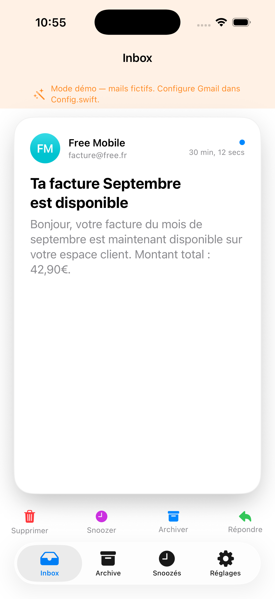
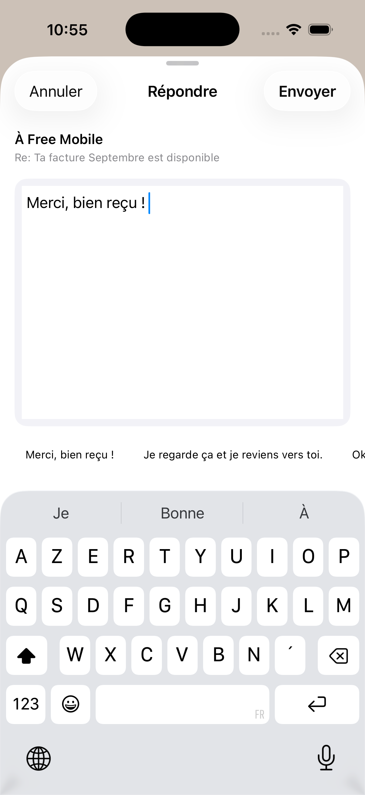
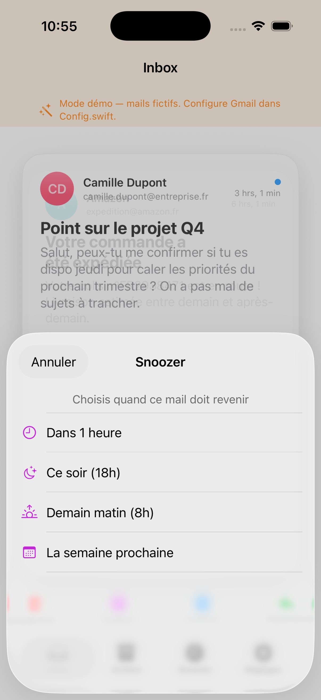
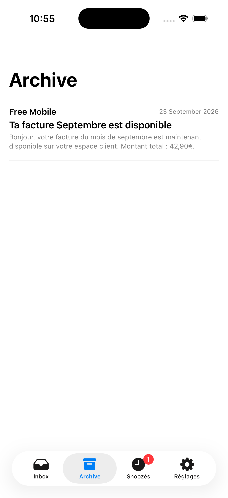
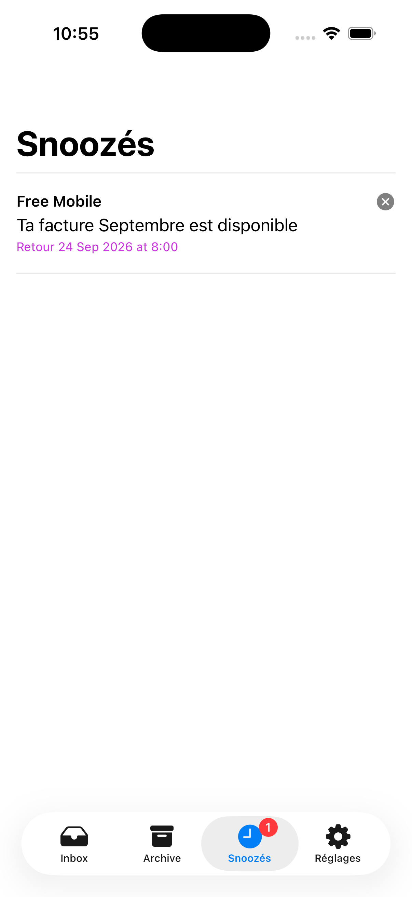
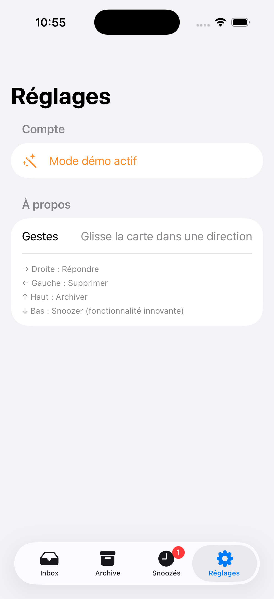

# MailSwipe

Une app iOS pour gérer ses mails Gmail d'un geste : swipe droite pour répondre, gauche pour supprimer, haut pour archiver, bas pour snoozer.

## Gestes

| Swipe | Action |
|---|---|
| → Droite | Répondre (feuille de réponse rapide) |
| ← Gauche | Supprimer |
| ↑ Haut | Archiver |
| ↓ Bas | Snoozer (revient plus tard, avec notification) |

## Captures d'écran

Captures prises sur simulateur iPhone 17, en **mode démo** (mails fictifs, aucun compte Gmail requis).

| Inbox | Répondre | Snoozer |
|---|---|---|
|  |  |  |

| Archive | Snoozés | Réglages |
|---|---|---|
|  |  |  |

## Fonctionnalités

- Pile de cartes : tap pour **lire le mail en entier**, swipe (ou boutons / VoiceOver) pour répondre, supprimer, archiver ou snoozer.
- **Annulation pendant 4 s** après chaque action, avant tout envoi au serveur ; retour automatique de la carte si l'appel échoue.
- Inbox **paginée** (les mails suivants se chargent quand il en reste peu).
- Réponses bien formées (fil de discussion, sujet accentué, `Reply-To`) ; les adresses « ne pas répondre » sont refusées avec une explication.
- **Snooze** réversible : le mail reçoit le libellé Gmail `MailSwipe/Snoozed` et revient dans la boîte à l'heure choisie, au prochain lancement de l'app.
- Français et anglais, accessibilité VoiceOver, mode démo isolé du vrai compte.
- Aucune donnée ne quitte l'iPhone hors des appels directs à Google ([politique de confidentialité](docs/PRIVACY.md)).

## Setup

Prérequis : Xcode 16+, [XcodeGen](https://github.com/yonaskolb/XcodeGen) (`brew install xcodegen`).

```bash
xcodegen generate
open MailSwipe.xcodeproj
```

Le projet Xcode (`.xcodeproj`) est généré depuis `project.yml` et n'est pas versionné. Sans configuration Gmail, l'app tourne en **mode démo** avec des mails fictifs.

**Signature (appareil réel / App Store)** : copie `Config/Local.xcconfig.example` en `Config/Local.xcconfig` (ignoré par git) et renseigne ton `DEVELOPMENT_TEAM`.

**Tests** (171 tests unitaires + 22 tests d'interface, ≈ 95 % des lignes de l'app couvertes) :

```bash
# tout, avec la couverture
xcodebuild test -project MailSwipe.xcodeproj -scheme MailSwipe \
  -destination 'platform=iOS Simulator,name=iPhone 17' -enableCodeCoverage YES

# unitaires seulement (≈ 1 s) / interface seulement (≈ 4 min)
xcodebuild test ... -only-testing:MailSwipeTests
xcodebuild test ... -only-testing:MailSwipeUITests
```

- **Unitaires** (`Tests/`) : flux OAuth et Keychain, appels HTTP Gmail via un faux réseau, pagination, annulation, persistance, MIME des réponses, analyse des corps de mails, règles de swipe, localisation, conformité App Store.
- **Interface** (`UITests/`) : parcours complets en mode démo, en français et en anglais — vrais gestes de swipe, annulation, lecture, réponse, snooze, onglets, boîte vide, écran de connexion. Ils se lancent avec `-ui-testing` (données jetables, notifications neutralisées, voir `LaunchOptions.swift`).
- Non couvert : l'ouverture réelle de la page de connexion Google (`ASWebAuthenticationSession`) et les actions personnalisées VoiceOver.

## Connecter un vrai compte Gmail

Voir les instructions détaillées dans [`Sources/Config.swift`](Sources/Config.swift) :
créer un projet Google Cloud, activer l'API Gmail, créer un Client ID OAuth de type iOS,
le coller dans `Config.swift`, puis mettre à jour `GOOGLE_REVERSED_CLIENT_ID_SCHEME`
dans `project.yml` avant de relancer `xcodegen generate`.

## État et limites connues

- **Jamais testé sur un vrai compte Gmail ni sur un iPhone physique** : les appels Gmail sont vérifiés par des tests HTTP simulés, pas contre l'API réelle.
- **Publication publique** : les autorisations `gmail.modify` et `gmail.send` sont « restreintes » par Google. Tant que l'app n'est pas validée par Google (vérification OAuth et évaluation de sécurité annuelle payante), elle est limitée à 100 testeurs déclarés et les connexions expirent au bout de 7 jours.
- **Snooze** : Gmail n'a pas d'API de snooze et l'app n'a pas de serveur. Le mail revient dans la boîte quand l'app est ouverte après l'heure choisie ; la notification locale prévient l'utilisateur.
- **App Review** : le mode démo permet de tester l'app sans compte Google ; à mentionner dans les notes de review.
- La politique de confidentialité est un brouillon à faire relire avant publication.

## Architecture

- `Sources/Models` — `EmailCard`, `SnoozeItem`
- `Sources/Services` — `AuthManager` (OAuth 2.0 + PKCE), `MailService` (protocole) implémenté par `GmailAPI` et `MockMailService`, `EmailStore` (état, annulation, pagination), `SnoozeScheduler`, `ReplyBuilder`, `EmailBodyParser`, `JSONFileStore`
- `Sources/Views` — UI SwiftUI, dont `SwipeCardView` pour le geste de swipe
- `Tests` — tests unitaires avec faux réseau (`StubURLProtocol`) et faux services
